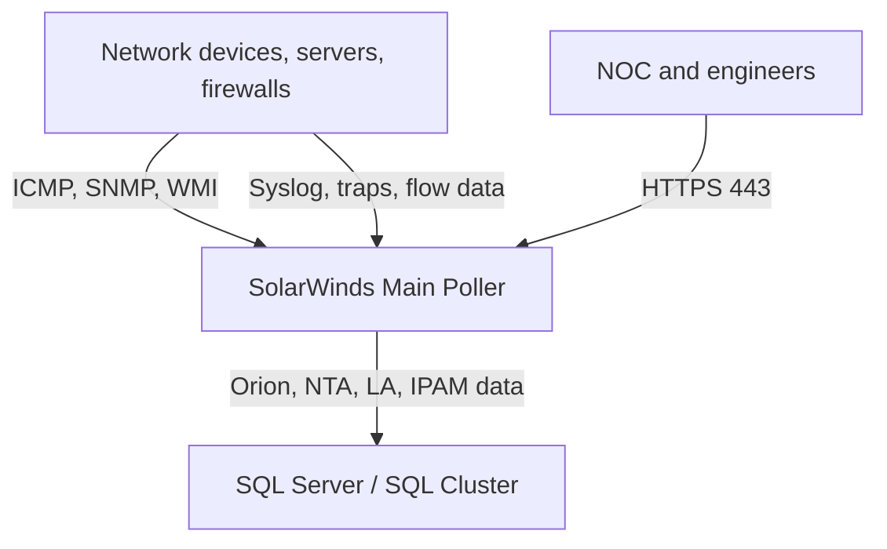
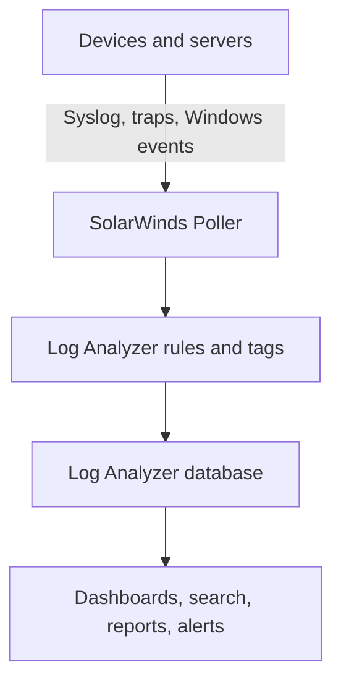
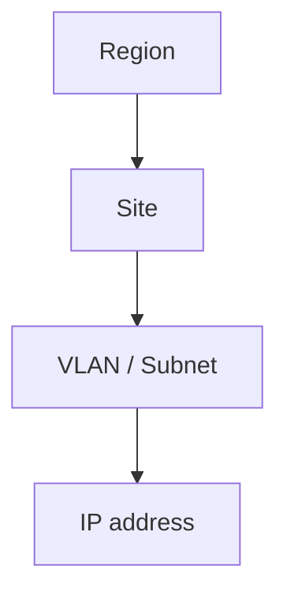

# Deploying SolarWinds Monitoring Platform in an Enterprise Environment

This guide explains how to deploy SolarWinds Platform as a centralised monitoring solution for an enterprise environment. The purpose is not merely to install the product, but to establish a monitoring platform that can be operated with discipline: clear architecture, appropriate access control, controlled polling, meaningful alerting, network configuration backup, log collection, IP address governance, and sufficient implementation evidence for operational documentation or a technical portfolio.

The reference design uses a SolarWinds Platform Server as the main poller, connected to a dedicated SQL Server or SQL cluster hosting the Orion database, Flow Storage database, Log Analyzer database, and IPAM database. The primary modules covered are Network Performance Monitor, NetFlow Traffic Analyzer, Network Configuration Manager, User Device Tracker, Log Analyzer, and IP Address Manager.

:::caution Publishing guidance
Do not publish real hostnames, private IP addresses, internal domains, customer names, alert recipients, service accounts, or email addresses. For a public portfolio, replace sensitive values with safe placeholders such as `solarwinds.company.local`, `SW-APP01`, `SW-SQL01`, `10.x.x.x`, `svc-solarwinds-db`, and `noc@example.com`.
:::

<!-- truncate -->

## 1. Business Context

Before a centralised monitoring platform is introduced, many organisations rely on fragmented operational tooling: one utility for device availability, another screen for interface utilisation, a spreadsheet for subnet records, scripts for network configuration backup, and unstructured mailboxes for syslog or alert notifications. This operating model slows incident response, weakens SLA reporting, complicates root-cause analysis, and leaves configuration changes difficult to govern.

SolarWinds addresses these operational gaps by consolidating infrastructure visibility into a single platform.

| Operational requirement | SolarWinds capability |
|---|---|
| Monitor network devices, servers, and interfaces | NPM collects availability, latency, packet loss, CPU, memory, disk, interface errors, and bandwidth utilisation through ICMP, SNMP, and WMI |
| Analyse traffic and top talkers | NTA collects NetFlow, sFlow, J-Flow, NetStream, or IPFIX to identify applications, endpoints, and conversations consuming bandwidth |
| Back up and compare network device configurations | NCM downloads running and startup configurations on schedule, stores archives, and highlights configuration differences |
| Collect syslog, traps, and events | Log Analyzer centralises logs within the Orion platform for searching, filtering, tagging, and correlation with nodes, interfaces, and applications |
| Govern subnets, DHCP, DNS, and IP conflicts | IPAM manages address space, subnet utilisation, DHCP/DNS integration, and IP conflict alerting |
| Provide a NOC-ready operational dashboard | The Web Console presents infrastructure state through dashboards, views, widgets, alerts, and reports |

## 2. Target Architecture

A production SolarWinds deployment should separate three concerns: monitored infrastructure, the SolarWinds Platform Server, and the database tier. For an environment with several hundred monitored devices, a single main poller is typically a practical starting point when sizing and polling intervals are correctly designed. As the number of elements increases, or as log and flow volume grows, the design can be extended with Additional Polling Engines or workload separation by site.



:::info Evidence to capture
Capture or redraw the SolarWinds architecture showing monitored devices, the main poller, SQL Server or SQL cluster, and the ICMP/SNMP/WMI/syslog/trap/flow data paths. Save it as:

`/img/solarwinds/01-solarwinds-server-topology.png`
:::


## 3. Deployed Modules

The reference environment deploys the following SolarWinds modules.

| Module | Role |
|---|---|
| SolarWinds Network Performance Monitor (NPM) | Monitors availability, latency, packet loss, CPU, memory, disk, interface status, and interface utilisation |
| SolarWinds NetFlow Traffic Analyzer (NTA) | Analyses flow traffic, top talkers, conversations, applications, and CBQoS metrics |
| SolarWinds Network Configuration Manager (NCM) | Provides network configuration backup, inventory, comparison, archive, and compliance workflows |
| SolarWinds User Device Tracker (UDT) | Tracks users, endpoints, switch port usage, and connection history |
| SolarWinds Log Analyzer | Collects syslog, traps, Windows events, applies filtering and tagging, and correlates logs with Orion objects |
| SolarWinds IP Address Manager (IPAM) | Manages subnets, IP utilisation, DHCP/DNS integration, and IP conflict detection |

For an initial implementation, deploy the modules in this order: NPM, NTA, NCM, Log Analyzer, IPAM, and then UDT. This sequence gives the operations team a stable node and interface monitoring foundation before adding traffic analysis, configuration backup, log correlation, address management, and user/device tracking.

## 4. Server Sizing

The reference design uses two principal server roles.

| Role | Platform | Reference sizing |
|---|---|---|
| SolarWinds Main Poller | Windows Server 2022 virtual machine | 16 vCPU, 64 GB RAM, separate OS, application, and archive volumes |
| SQL Server | SQL Server 2022 virtual machine or cluster | 16 vCPU, 128 GB RAM, separate volumes for database files, log files, NTA Flow Storage, Log Analyzer data, and backups |

Storage should be separated by workload rather than placed on a single general-purpose volume.

| Workload | Recommendation |
|---|---|
| Operating system | Dedicated Windows system volume |
| SolarWinds application | Dedicated application volume |
| Configuration archive | Dedicated volume for NCM archives |
| Orion database data | Dedicated SQL data volume |
| Orion database log | Dedicated SQL transaction log volume |
| NTA Flow Storage | Dedicated volume because flow data is I/O intensive |
| Log Analyzer data and logs | Dedicated volumes if event volume or retention is high |

SolarWinds Platform requires IIS and the appropriate .NET Framework components. The installer can deploy several prerequisites automatically, but the implementation team should validate the server baseline before installation to avoid delays during the change window.

## 5. Pre-Implementation Checklist

Complete the following prerequisites before running the installer.

| Area | Requirement |
|---|---|
| Server access | Local Administrator rights on the SolarWinds server and appropriate permissions on SQL Server |
| Installer | SolarWinds installer downloaded from the Customer Portal, aligned with the purchased modules and licence entitlement |
| Database | SQL Server available; service account able to create and own SolarWinds databases |
| AD authentication | Active Directory groups prepared for administrators, node management, read-only users, and NOC dashboard access |
| DNS | Friendly FQDN for the Web Console, for example `solarwinds.company.local` |
| Certificate | PFX certificate available for HTTPS |
| SMTP | Mail relay approved for alerting and NCM job notifications |
| Time synchronisation | SolarWinds and SQL servers using the same time source and timezone |
| SNMP, WMI, and SSH | Credentials prepared for monitoring, Windows polling, and configuration backup |
| Backup | Backup policy defined for the application server, SQL databases, configuration archive, and installers |
| Antivirus exclusions | Exclusions prepared for SolarWinds directories, IIS temporary files, ProgramData, Common Files, SQL data/log paths, and relevant Windows temporary directories |

:::info Evidence to capture
Capture the implementation prerequisite checklist or the approved project readiness table. Save it as:

`/img/solarwinds/02-deployment-prerequisites.png`
:::

## 6. Installing SolarWinds Platform

### 6.1. Prepare the Windows Server

On the SolarWinds application server, validate the following items.

| Item | Expected state |
|---|---|
| Windows Server | Windows Server 2022 installed and patched |
| Disk layout | OS, application, and archive drives created |
| DNS resolution | SQL Server and Web Console FQDN resolve correctly |
| Firewall | SQL connectivity allowed on the default or custom SQL port |
| Service account | Installation account has local administrator rights |
| Antivirus | Required exclusions configured, or scanning temporarily disabled during the approved maintenance window |

If the design requires SolarWinds `ProgramData` or `Common Files` to reside on a dedicated application drive, use NTFS junctions only after this decision has been formally approved. Incorrect junction paths can disrupt installation, upgrades, and service operation.

```powershell
mkdir E:\ProgramData\SolarWinds
New-Item -ItemType Junction -Path "C:\ProgramData\SolarWinds" -Target "E:\ProgramData\SolarWinds"

mkdir "E:\Program Files (x86)\Common Files\SolarWinds"
New-Item -ItemType Junction -Path "C:\Program Files (x86)\Common Files\SolarWinds" -Target "E:\Program Files (x86)\Common Files\SolarWinds"
```

### 6.2. Run the SolarWinds Installer

Use the following implementation workflow.

1. Sign in to the SolarWinds server with an account that has local administrator rights.
2. Copy the installer to a controlled deployment folder such as `E:\Installers\SolarWinds`.
3. Run the installer as Administrator.
4. Select the required modules: NPM, NTA, NCM, UDT, Log Analyzer, and IPAM.
5. Configure the database connection to the SQL Server or SQL cluster.
6. Select or create the required databases: Orion/NMS, NTA Flow Storage, Log Analyzer, and IPAM.
7. Complete the software installation.
8. Run the Configuration Wizard to configure the website, services, and database schema.
9. Confirm that Orion services have started successfully.
10. Access the Web Console over HTTPS.

:::info Evidence to capture
Capture the SolarWinds Installer module selection screen and the Configuration Wizard database connection screen. Save them as:

`/img/solarwinds/03-solarwinds-installer-modules.png`

`/img/solarwinds/04-configuration-wizard-database.png`
:::

## 7. Web Console Configuration

The SolarWinds Web Console should be exposed internally over HTTPS on port 443, using a friendly FQDN rather than an IP address.

| Component | Example value |
|---|---|
| Web Console FQDN | `https://solarwinds.company.local` |
| Web Console port | TCP 443 |
| Authentication | Active Directory group-based access |
| Certificate | Internal CA or wildcard certificate |
| Local administrator account | Reserved for break-glass or emergency administration |

After the first successful login, validate the following:

1. Each module licence is active.
2. Orion services are running normally.
3. The HTTPS certificate is trusted and valid.
4. Active Directory groups can authenticate.
5. The default local administrator account is protected with a strong password and stored in a credential vault.

:::info Evidence to capture
Capture successful HTTPS access to the Web Console and the Deployment Health or licence status page. Save them as:

`/img/solarwinds/05-web-console-https.png`

`/img/solarwinds/06-deployment-health.png`
:::

## 8. Database Configuration

SolarWinds uses SQL Server to store configuration, metrics, flow records, logs, and IPAM data. Where NTA and Log Analyzer are deployed, database design is particularly important because flow and log data can grow rapidly.

| Database | Purpose |
|---|---|
| Orion/NMS database | Stores nodes, interfaces, volumes, alerts, events, accounts, views, reports, and polling data |
| NTA Flow Storage database | Stores flow records for traffic analysis |
| Log Analyzer database | Stores log events, rules, tags, and searchable log data |
| IPAM database | Stores subnets, IP addresses, DHCP/DNS records, scan history, and IPAM events |

Operational recommendations:

1. Separate data files and transaction log files.
2. Monitor disk latency and IOPS.
3. Configure SQL backups using full, differential, and transaction log schedules aligned with RPO and RTO.
4. Do not place SolarWinds databases on the OS volume.
5. Review retention before increasing nodes, interfaces, flow sources, or log sources.
6. Monitor nightly maintenance jobs to ensure they complete within the expected window.

## 9. Polling Configuration

Polling determines how quickly SolarWinds collects data and directly affects poller load, SQL Server load, and monitored device overhead.

Reference polling settings:

| Polling type | Reference value | Purpose |
|---|---:|---|
| Node status poll | 120 seconds | Checks node availability and response time |
| Interface status poll | 120 seconds | Checks interface status |
| Volume status poll | 120 seconds | Checks volume status |
| Rediscovery interval | 30 minutes | Refreshes node and interface metadata |
| Node statistics poll | 10 minutes | Collects CPU, memory, and other node statistics |
| Interface statistics poll | 9 minutes | Collects interface traffic, errors, and discards |
| Volume statistics poll | 15 minutes | Collects disk and volume utilisation |
| Node topology poll | 30 minutes | Collects topology information |

Reference retention settings:

| Data type | Retention |
|---|---:|
| Detailed statistics | 7 days |
| Hourly statistics | 30 days |
| Daily statistics | 365 days |
| Events | 30 days |
| Syslog messages | 7 days |
| Trap messages | 7 days |
| Discovery profiles | 60 days |

Critical devices such as core switches, firewalls, WAN edge routers, or ISP-facing devices may require custom polling intervals. Avoid reducing global polling intervals unless poller capacity, SQL performance, and device overhead have been assessed.

:::info Evidence to capture
Capture `Settings > All Settings > Polling Settings`, including polling intervals and retention values. Save it as:

`/img/solarwinds/07-orion-polling-settings.png`
:::

## 10. Authentication and Role-Based Access Control

SolarWinds access should be governed through Active Directory groups. Direct permissions assigned to individual users should be treated as exceptions and reviewed periodically.

Reference group model:

| AD group | Permission model |
|---|---|
| `GG-SolarWinds-Admins` | Full administration across system settings, accounts, alerts, reports, nodes, and modules |
| `GG-SolarWinds-NodeManagement` | Add, edit, and remove nodes without full system administration |
| `GG-SolarWinds-ReadOnly` | View dashboards, nodes, alerts, and reports |
| `GG-SolarWinds-NOC` | View NOC dashboards and acknowledge alerts where approved |
| `GG-SolarWinds-NetworkOps` | Manage network-related nodes, interfaces, and views within the defined operational scope |

If users need to see only devices owned by their team, site, or business unit, implement Account Limitations together with Custom Properties. For example, a network operations group may see only nodes where `Team = Network`, while a site team may see only nodes where `Location = HCMC`.

:::info Evidence to capture
Capture the AD group configuration in SolarWinds account management and one Account Limitation example if implemented. Save them as:

`/img/solarwinds/08-ad-group-permissions.png`

`/img/solarwinds/09-account-limitations.png`
:::

## 11. Threshold Configuration

Thresholds should start from a conservative baseline and then be tuned using real operational data. Thresholds that are too low generate noise; thresholds that are too high remove early-warning value.

General thresholds:

| Metric | Warning | Critical |
|---|---:|---:|
| CPU load | 80% | 90% |
| Disk usage | 90% | 95% |
| Memory used | 80% | 90% |
| Packet loss | 30% | 50% |
| Response time | 500 ms | 1000 ms |

NPM thresholds:

| Metric | Warning | Critical |
|---|---:|---:|
| Interface utilisation | 80% | 90% |
| Interface errors and discards | 1000 | 2500 |
| Cisco buffer misses | 10 | 100 |
| Route flaps | 5 | 10 |

Uplinks, WAN interfaces, Internet edges, and core switching interfaces should have thresholds aligned with their operational role. A user access port and a business-critical WAN link should not share the same alerting strategy.

:::info Evidence to capture
Capture Orion threshold settings and an example node or interface threshold override for a critical device. Save them as:

`/img/solarwinds/10-general-thresholds.png`

`/img/solarwinds/11-interface-threshold-override.png`
:::

## 12. NPM Implementation

NPM is the foundation of the monitoring platform. After the platform is installed, the first priority is to onboard nodes and interfaces in a controlled manner.

Implementation workflow:

1. Prepare a device inventory containing hostname, IP address, site, device type, vendor, SNMP version, credential, and owning team.
2. Configure SNMP credentials in SolarWinds.
3. Add nodes using Network Sonar Discovery or manual onboarding.
4. Select the interfaces that require monitoring; avoid monitoring every unused or low-value interface.
5. Assign Custom Properties such as `Location`, `Device_Type`, `Criticality`, `Environment`, `Team`, and `ISP`.
6. Validate node status, response time, packet loss, CPU, memory, hardware health, and interface utilisation.
7. Create groups and views by site, service, or operational ownership.

:::info Evidence to capture
Capture an NPM node details page showing CPU, memory, response time, packet loss, and interface utilisation. Save it as:

`/img/solarwinds/12-npm-node-details.png`
:::

## 13. NTA Implementation

NTA answers the questions that standard interface utilisation cannot: who is consuming the bandwidth, which application is responsible, which endpoints are involved, and in which direction the traffic is flowing.

Reference settings:

| Setting | Value |
|---|---|
| Flow collector port | UDP 2055 |
| Auto-add flow sources monitored by NPM | Enabled |
| Retain traffic on unmonitored ports | Enabled |
| Allow flows from unmanaged interfaces | Disabled |
| Match nodes by secondary IP | Enabled |
| CBQoS polling | Enabled |
| CBQoS polling interval | 300 seconds |
| DNS resolution | Persistent |
| Flow retention | 30 days |
| Progressive charting | Enabled |
| Default chart period | Last 1 hour |

Implementation workflow:

1. Identify devices that should export flow data, such as firewalls, WAN routers, core switches, or Internet edge devices.
2. Enable NetFlow, sFlow, IPFIX, or the vendor-specific flow protocol on the source device.
3. Configure the collector destination as the SolarWinds Main Poller IP address on UDP 2055.
4. Ensure that the exporting interface is also managed in NPM.
5. Confirm that the flow source appears in NTA.
6. Review Top Talkers, Top Applications, Top Conversations, and endpoint traffic.
7. Adjust retention if flow data grows faster than the SQL design can sustain.

:::info Evidence to capture
Capture the NTA Summary page, flow source list, and one Top Talkers or Top Conversations view. Save them as:

`/img/solarwinds/13-nta-summary.png`

`/img/solarwinds/14-nta-flow-sources.png`

`/img/solarwinds/15-nta-top-talkers.png`
:::

## 14. NCM Implementation

NCM provides governance over network device configuration. Its most important value is scheduled backup, configuration comparison, and evidence for post-change troubleshooting.

Reference settings:

| Setting | Value |
|---|---|
| Running and startup configuration monitoring | Enabled |
| Simultaneous download/upload sessions | 10 |
| Minimum configuration length | 11 lines |
| Save to configuration archive | Enabled |
| Archive naming template | `${Caption}_${YYYY}-${MM}-${DD}-${HH}${minute}_${ConfigType}.Config` |
| ICMP timeout | 2500 ms |
| SNMP timeout | 1000 ms |
| Telnet/SSH timeout | 45 seconds |
| SCP transfer directory | `C:\SFTP_Root` |
| TFTP transfer directory | `C:\TFTP_Root` |

Use SSH instead of Telnet wherever supported. Telnet should remain limited to approved legacy use cases where the risk has been explicitly accepted.

Implementation workflow:

1. Create connection profiles for each vendor, device family, or operational domain.
2. Assign credentials with the required read or backup privileges.
3. Enable NCM on the relevant nodes.
4. Test running configuration download.
5. Test startup configuration download.
6. Enable the nightly configuration backup job.
7. Store the configuration archive on a dedicated volume.
8. Validate running versus startup comparison.
9. Confirm email notification for scheduled job results.

Reference jobs:

| Job | Schedule | Purpose |
|---|---|---|
| Nightly Config Backup | Daily at 2:00 AM | Downloads running and startup configurations, saving only changed versions |
| Database and Archive Maintenance | Sunday at 4:00 AM | Cleans old inventory, cache, and archived configuration data |
| Purge Configs | Sunday at 1:00 AM | Removes old configurations while retaining the latest versions according to policy |

:::info Evidence to capture
Capture the connection profile, a successful configuration download, the nightly backup schedule, and a configuration comparison view. Save them as:

`/img/solarwinds/16-ncm-connection-profile.png`

`/img/solarwinds/17-ncm-download-config-success.png`

`/img/solarwinds/18-ncm-nightly-backup-job.png`

`/img/solarwinds/19-ncm-config-comparison.png`
:::

## 15. Log Analyzer Implementation

Log Analyzer centralises syslog, SNMP traps, and Windows event logs within the Orion platform. Its operational value comes from correlating log events with nodes, interfaces, and alerts already managed by SolarWinds.

Processing flow:



Implementation workflow:

1. Install or enable the Log Analyzer module on the SolarWinds Platform Server.
2. Run the Configuration Wizard to create or connect the Log Analyzer database.
3. Open the required firewall paths for syslog on UDP/TCP 514 and SNMP traps on UDP 162.
4. Configure firewalls, switches, routers, and servers to send syslog or traps to the SolarWinds poller.
5. Create rules for high-value events such as interface flaps, routing neighbour changes, firewall denies, authentication failures, and device configuration changes.
6. Use tags to classify events by severity or operational use case.
7. Build dashboards for Top Log Sources, Log Volume Over Time, and Recent Critical Events.
8. Configure retention according to operational and audit requirements.

:::info Evidence to capture
Capture Log Analyzer search, a sample rule, and a log dashboard. Save them as:

`/img/solarwinds/20-log-analyzer-search.png`

`/img/solarwinds/21-log-analyzer-rule.png`

`/img/solarwinds/22-log-analyzer-dashboard.png`
:::

## 16. IPAM Implementation

IPAM allows the network team to manage address space structurally rather than relying on disconnected spreadsheets. In larger environments, it also supports conflict detection, subnet utilisation monitoring, and DHCP/DNS integration.

Recommended hierarchy:



Implementation workflow:

1. Install or enable the IPAM module.
2. Create the IPAM database on SQL Server.
3. Import existing address space from spreadsheets, exports, or discovery results.
4. Build the hierarchy as Region, Site, VLAN/Subnet, and IP address.
5. Configure scan methods such as ping, SNMP, ARP, or DHCP/DNS integration.
6. Integrate DHCP and DNS servers where approved.
7. Configure alerts for IP conflicts, subnet utilisation above 80% or 90%, full DHCP scopes, and stale DNS records.
8. Define an IP allocation workflow: request, approval, reservation, DHCP/DNS update, and documentation.

:::info Evidence to capture
Capture the IPAM subnet tree, subnet utilisation, IP conflict alert, and DHCP/DNS integration if implemented. Save them as:

`/img/solarwinds/23-ipam-subnet-tree.png`

`/img/solarwinds/24-ipam-subnet-utilization.png`

`/img/solarwinds/25-ipam-dhcp-dns-integration.png`
:::

## 17. Custom Properties

Custom Properties are the foundation for filtered dashboards, access limitations, alert routing, and reporting. They should be standardised early; retrofitting them after hundreds of nodes have been onboarded is far more time-consuming.

Reference properties:

| Custom Property | Data type | Purpose |
|---|---|---|
| `Priority` | Integer | Assigns P1, P2, or P3 operational priority |
| `Production` | Boolean | Distinguishes production from non-production assets |
| `Location` | Text | Identifies site, building, campus, or region |
| `Criticality` | Text/List | Classifies assets as Critical, High, Medium, or Low |
| `Device_Type` | Text/List | Identifies routers, switches, firewalls, servers, or wireless devices |
| `Team` | Text/List | Assigns ownership to Network, Security, Infrastructure, or Application teams |
| `ISP` | Text | Links WAN or Internet interfaces to a carrier |
| `Service_ID` | Text | Associates nodes or interfaces with a business service |

Operational examples:

1. A P1 alert sends on-call notifications only when `Priority = 1` and `Production = True`.
2. The NOC dashboard displays only production nodes.
3. WAN reports filter interfaces where `ISP` is populated.
4. Account Limitations restrict a team to devices where `Team = Network`.

:::info Evidence to capture
Capture the Custom Property Editor and one node with populated custom properties. Save them as:

`/img/solarwinds/26-custom-property-editor.png`

`/img/solarwinds/27-node-custom-properties.png`
:::

## 18. Alerting Design

Alerting must reduce noise, clarify ownership, and drive action. A well-designed alert explains what failed, what is affected, who should respond, what action is expected, and when escalation is required.

Baseline alerts:

| Alert | Purpose |
|---|---|
| Node Down / Node Up | Detects device loss and recovery |
| Node Rebooted | Detects unexpected reboot events |
| Interface Down | Monitors critical uplinks, WAN links, trunks, and high-value interfaces |
| High CPU Utilisation | Detects overloaded control planes or servers |
| High Memory Utilisation | Detects memory pressure |
| High Interface Utilisation | Detects bandwidth congestion |
| High Volume Utilisation | Detects disks approaching capacity |
| Hardware Health Problem | Detects PSU, fan, temperature, module, or sensor issues |
| Application Down | Detects service or application failure |
| Routing Neighbour Down | Detects BGP, OSPF, or EIGRP neighbour loss |
| Remaining Licences | Tracks SolarWinds licence capacity |

Example P1 node-down alert:

| Component | Example configuration |
|---|---|
| Trigger condition | `Node Status = Down`, `Priority = 1`, `Production = True` |
| Reset condition | Node returns to Up during the next polling cycle |
| Suppression | No trigger during an approved maintenance window |
| Action | Email NOC, notify on-call engineer, create an ITSM ticket if integrated |
| Message | Includes node name, IP address, location, device type, last boot, response time, and custom properties |

:::info Evidence to capture
Capture the alert trigger condition, reset condition, trigger action, and email message. Save them as:

`/img/solarwinds/28-alert-node-down-trigger.png`

`/img/solarwinds/29-alert-node-down-reset.png`

`/img/solarwinds/30-alert-email-action.png`

`/img/solarwinds/31-active-alerts-view.png`
:::

## 19. SMTP and ITSM Integration

SMTP is required for email-based alerting. Use an approved internal mail relay rather than a personal mailbox.

| Item | Example value |
|---|---|
| SMTP server | `smtp.company.local` |
| Port | 25, 465, or 587 according to the mail relay configuration |
| Authentication | Based on enterprise mail policy |
| Sender | `solarwinds-noreply@example.com` |
| Recipient | `noc@example.com`, `network-ops@example.com` |

If the organisation uses ServiceNow or another ITSM platform, SolarWinds alerts can be integrated to create incidents. Before enabling automatic ticket creation, define severity mapping, assignment groups, deduplication behaviour, and maintenance window handling. Without these controls, a single infrastructure event can generate excessive tickets.

:::info Evidence to capture
Capture SMTP server settings and a successful test alert email. Save them as:

`/img/solarwinds/32-smtp-server-settings.png`

`/img/solarwinds/33-alert-test-email.png`
:::

## 20. Hardware Health and Universal Device Poller

Hardware Health monitors sensors such as fans, power supplies, temperature, stack members, and module status. Some sensors can create false positives, especially transceiver sensors on ports that are physically populated but not operationally used. Review hardware sensors after device onboarding and disable only those sensors that have been validated as irrelevant or noisy.

Universal Device Poller collects additional SNMP OID data when vendor-specific metrics are not available through built-in templates.

| Use case | Example |
|---|---|
| UPS monitoring | APC battery status, load, and runtime |
| Vendor-specific switch or wireless metrics | Aruba or HP stack/member status |
| ADC or load balancer visibility | NetScaler virtual server status |
| Environmental monitoring | Temperature or humidity OIDs |

:::info Evidence to capture
Capture Manage Hardware Sensors and one Universal Device Poller assigned to a node. Save them as:

`/img/solarwinds/34-hardware-health-sensors.png`

`/img/solarwinds/35-universal-device-poller.png`
:::

## 21. Dashboards and NOC Views

Dashboards should be designed around the audience. The NOC needs immediate operational status and open alerts. Network engineers need interfaces, routing, flow, and configuration backup visibility. Managers need availability, capacity, and trend reporting.

Reference dashboards:

| Dashboard | Content |
|---|---|
| NOC Wallboard | Active alerts, nodes down, critical interfaces, WAN utilisation, and hardware health |
| Network Operations | Top high-utilisation interfaces, packet loss, routing neighbour status, and NTA top talkers |
| Configuration Management | NCM job status, failed backups, configuration changes, and startup/running mismatches |
| IPAM Overview | Top subnet utilisation, IP conflicts, and DHCP scope capacity |
| Log Operations | Top log sources, recent critical logs, and log volume trends |

For a wallboard, enable view rotation at approximately 30-second intervals if the NOC display needs to cycle through multiple operational views.

:::info Evidence to capture
Capture the NOC dashboard or a customised operational dashboard after real nodes, alerts, and metrics are available. Save it as:

`/img/solarwinds/36-noc-dashboard.png`
:::

## 22. Port and Firewall Requirements

Firewall rules should be opened according to the actual traffic direction. Avoid broad any-to-any rules between infrastructure VLANs simply to make SolarWinds work.

| Port | Protocol | Direction | Purpose |
|---:|---|---|---|
| 22 | TCP | SolarWinds to devices | SSH for NCM or device CLI access |
| 23 | TCP | SolarWinds to devices | Telnet for approved legacy devices only |
| 25 / 465 / 587 | TCP | SolarWinds to mail server | SMTP alerting and notification |
| 53 | UDP/TCP | SolarWinds to/from DNS | DNS resolution |
| 80 / 443 | TCP | Clients to SolarWinds | Web Console HTTP/HTTPS |
| 161 | UDP | SolarWinds to devices | SNMP polling |
| 162 | UDP | Devices to SolarWinds | SNMP traps |
| 514 | UDP/TCP | Devices to SolarWinds | Syslog |
| ICMP | ICMP | SolarWinds to/from devices | Availability, response time, and packet loss |
| 2055 | UDP | Devices to SolarWinds | NetFlow collector |
| 1433 or custom SQL port | TCP | SolarWinds to SQL Server | Database connection |
| 17777 | TCP | Poller/Web to main server | SolarWinds inter-server communication |
| 17778 | TCP | Agents to SolarWinds | Agent communication |
| 5671 | TCP | Poller/Web to main server | RabbitMQ SSL messaging |
| 4369 / 25672 | TCP | SolarWinds servers | RabbitMQ and Erlang clustering for multi-server deployments |

:::info Evidence to capture
Capture the approved firewall rule request or a sanitised port matrix. If the original request contains sensitive information, publish only a redacted diagram or table. Save it as:

`/img/solarwinds/37-port-requirements.png`
:::

## 23. Post-Deployment Validation

After installation and initial configuration, validate the platform before declaring it operational.

| Test | Expected result |
|---|---|
| Access Web Console over HTTPS | Trusted certificate and successful login |
| Active Directory group login | User receives the correct permissions through group membership |
| Add node using SNMP | Node is Up and returns CPU, memory, and interface data |
| Add Windows node using WMI or agent | CPU, memory, disk, and services are collected where configured |
| Interface polling | Utilisation, errors, and discards are visible |
| NTA flow | Flow source is active and top talkers/conversations are visible |
| NCM backup | Running and startup configurations download successfully |
| Log Analyzer | Syslog or traps are received and searchable |
| IPAM scan | Subnets show utilisation and IP status |
| Alert test | Alert triggers, resets, and sends notification to the correct recipient |
| Database maintenance | Maintenance job runs on schedule without errors |
| Backup | SQL and application backups complete successfully |

:::info Evidence to capture
Capture the validation results or the key pass/fail screens. Save it as:

`/img/solarwinds/38-post-deployment-validation.png`
:::

## 24. Operational Handover and Ongoing Management

After go-live, SolarWinds should be operated as a production platform rather than a secondary utility.

| Frequency | Operational activity |
|---|---|
| Daily | Review active alerts, failed polling, failed NCM jobs, disk capacity, and database maintenance |
| Weekly | Review alert noise, failed configuration backups, newly discovered unmanaged interfaces, and top utilisation |
| Monthly | Review capacity, licence usage, database growth, retention, dashboards, and reports |
| Quarterly | Review RBAC, AD groups, service accounts, certificate expiry, and backup restore testing |
| After major changes | Review polling load, SQL performance, alert volume, and node/interface inventory |

Monitor the health of SolarWinds itself using the following indicators:

1. Polling completion rate.
2. SQL waits, latency, and database growth.
3. Free disk space on application, archive, and SQL volumes.
4. Number of elements per poller.
5. NTA flow volume.
6. Log Analyzer event rate and retention.
7. Alert volume by alert type.
8. NCM job success rate.

## 25. Implementation Outcomes

When implemented correctly, SolarWinds provides the operations team with a centralised monitoring platform capable of:

1. Monitoring network and server health from a single Web Console.
2. Detecting device, interface, and service outages faster.
3. Analysing bandwidth consumption using flow data rather than assumptions.
4. Backing up network device configurations on schedule and comparing changes.
5. Searching logs in the context of affected nodes and interfaces.
6. Governing subnets, DHCP, DNS, and IP conflicts more consistently.
7. Presenting a practical NOC dashboard for daily operations.
8. Producing evidence for audit, troubleshooting, and post-incident review.

## 26. Portfolio Evidence Checklist

If this article is published as part of a technical portfolio, prepare the following screenshots. Redact hostnames, IP addresses, domains, usernames, email addresses, customer names, and any operationally sensitive values.

| Image file | Evidence to capture |
|---|---|
| `01-solarwinds-server-topology.png` | Architecture diagram showing the main poller, SQL Server/cluster, and monitored devices |
| `02-deployment-prerequisites.png` | Pre-installation prerequisite checklist |
| `03-solarwinds-installer-modules.png` | Installer module selection |
| `04-configuration-wizard-database.png` | Configuration Wizard database connection |
| `05-web-console-https.png` | Web Console over HTTPS |
| `06-deployment-health.png` | Deployment Health or module/licence status |
| `07-orion-polling-settings.png` | Polling intervals and retention settings |
| `08-ad-group-permissions.png` | AD group permissions |
| `09-account-limitations.png` | Account Limitations, if implemented |
| `10-general-thresholds.png` | General threshold settings |
| `11-interface-threshold-override.png` | Threshold override for a critical interface |
| `12-npm-node-details.png` | NPM node details page |
| `13-nta-summary.png` | NTA Summary |
| `14-nta-flow-sources.png` | Flow sources |
| `15-nta-top-talkers.png` | Top Talkers or Top Conversations |
| `16-ncm-connection-profile.png` | NCM connection profile |
| `17-ncm-download-config-success.png` | Successful configuration download |
| `18-ncm-nightly-backup-job.png` | Nightly Config Backup job |
| `19-ncm-config-comparison.png` | Configuration comparison |
| `20-log-analyzer-search.png` | Log Analyzer search |
| `21-log-analyzer-rule.png` | Log rule or tag |
| `22-log-analyzer-dashboard.png` | Log dashboard |
| `23-ipam-subnet-tree.png` | IPAM subnet tree |
| `24-ipam-subnet-utilization.png` | IPAM subnet utilisation |
| `25-ipam-dhcp-dns-integration.png` | DHCP/DNS integration |
| `26-custom-property-editor.png` | Custom Property Editor |
| `27-node-custom-properties.png` | Node with populated custom properties |
| `28-alert-node-down-trigger.png` | Alert trigger condition |
| `29-alert-node-down-reset.png` | Alert reset condition |
| `30-alert-email-action.png` | Alert email action |
| `31-active-alerts-view.png` | Active Alerts view |
| `32-smtp-server-settings.png` | SMTP server settings |
| `33-alert-test-email.png` | Alert test email |
| `34-hardware-health-sensors.png` | Hardware sensors |
| `35-universal-device-poller.png` | Universal Device Poller |
| `36-noc-dashboard.png` | NOC dashboard |
| `37-port-requirements.png` | Sanitised port matrix or firewall request |
| `38-post-deployment-validation.png` | Post-deployment validation checklist |

## 27. Conclusion

A mature SolarWinds implementation does not end with installing NPM and adding a handful of devices. Its real value depends on the way the platform is governed: correctly sized servers and databases, controlled polling, AD-based access, clean Custom Properties, actionable alerts, reliable NCM backups, appropriate log and flow retention, accurate IPAM data, and dashboards designed for real operational users.

Implemented in this manner, SolarWinds becomes a central operational platform for network infrastructure. It helps Network and NOC teams detect incidents sooner, investigate root causes with better context, and produce credible evidence for service reporting, audit, and continuous improvement.
