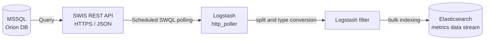

SolarWinds, now formally known as the **SolarWinds Platform** and still commonly associated with its core *Orion* architecture, remains one of the most widely deployed network monitoring systems in enterprise data centers. In many organizations, however, the observability team also wants this data available in Elastic so it can be searched, visualized, alerted on, and correlated with logs, traces, endpoint telemetry, and application performance data.

This article presents a production-ready reference architecture for polling SolarWinds data through **SWQL/SWIS** and ingesting it into Elastic with the Logstash `http_poller` input. It is based on a practical pipeline design review and includes four reference datasets: network interfaces, CPU and memory, hardware temperature, and UPS metrics. During the review, several issues were identified in the original draft configuration, including disabled TLS verification, hard-coded credentials, an unnecessary JSON filter, a malformed SWQL statement, and a temperature query that only targeted a single hardware record.

The purpose of this article is not only to show how the pipeline works, but also to document what should be verified before promoting it into production.

<!--truncate-->

## Architecture Overview

**SolarWinds Information Service (SWIS)** is the data access layer of the SolarWinds Platform. It exposes Orion data through a JSON-based REST API and allows read-oriented queries using **SWQL**: SolarWinds Query Language. SWQL has a SQL-like syntax and supports common query patterns such as `SELECT`, `JOIN`, `WHERE`, `GROUP BY`, `ORDER BY`, `TOP n`, and subqueries.

For this use case, Logstash calls the SWIS `Query` endpoint over HTTPS, receives a JSON response in the format `{"results": [...]}`, splits each row into an individual event, normalizes selected fields, and writes the events into Elastic as metrics data streams.



:::note Evidence screenshot
Capture a screenshot of the final architecture diagram used in your portfolio article.

Suggested file name: `solarwinds-elastic-reference-architecture.png`
:::

Logstash `http_poller` calls the SWIS `Query` endpoint on a fixed schedule. The JSON response is decoded by the input codec, and the `results` array is split into separate events before being indexed into Elasticsearch.

:::note
The diagram above uses Mermaid. If your Docusaurus site does not already support Mermaid diagrams, install `@docusaurus/theme-mermaid` and enable it in `docusaurus.config.ts` with `markdown: { mermaid: true }` and `themes: ['@docusaurus/theme-mermaid']`.
:::

### Why Poll SolarWinds Instead of Polling SNMP Directly?

Logstash can poll SNMP directly through the `logstash-integration-snmp` plugin. That can be the right design when no network monitoring platform exists and Elastic is intended to become the primary polling layer.

In an enterprise environment where SolarWinds already performs network monitoring, polling SWIS is usually more efficient and operationally cleaner. SolarWinds already handles device polling, MIB interpretation, interface-to-node relationships, operational status, utilization calculations, and device inventory enrichment. Reusing that normalized data avoids rebuilding SNMP logic in Logstash.

The trade-off is that the freshness of the data is bounded by the SolarWinds polling interval. Polling SWIS every minute does not create more accurate interface counters if SolarWinds itself only refreshes those counters every five or nine minutes. This must be considered when defining Logstash schedules.

## Infrastructure Prerequisites

Before deploying the pipeline, validate the following prerequisites:

- The Logstash host can reach the SolarWinds SWIS endpoint over HTTPS.
- The SWIS port is confirmed with the SolarWinds administrator. The commonly documented default is `17778`, but some environments use a custom or legacy port.
- Logstash 8.x or 9.x is available. The `http_poller` input is included with the standard Logstash distribution.
- A dedicated SolarWinds read-only service account exists for SWIS access.
- Elastic Cloud or a self-managed Elasticsearch cluster is available.
- Metrics data streams are enabled in Elasticsearch.
- The internal CA certificate is available if SolarWinds uses a certificate issued by a private CA.
- The Logstash keystore has been initialized on every Logstash node that will run the pipeline.

:::note Evidence screenshot
Capture evidence that the Logstash server can reach the SWIS endpoint.

Recommended evidence:

- `curl -vk https://<solarwinds-host>:<port>/SolarWinds/InformationService/v3/Json/Query`
- Windows PowerShell `Test-NetConnection <solarwinds-host> -Port <port>`
- Firewall or network connectivity check showing the Logstash host reaching SolarWinds

Suggested file name: `logstash-to-swis-connectivity-test.png`
:::

## Security Baseline: TLS and Secret Management

Two security controls should be in place before any pipeline is promoted to a production namespace:

- Credentials must not be stored as plain text in Logstash pipeline files.
- TLS certificate verification must remain enabled.

The reviewed draft correctly mentioned these requirements, but the sample pipeline configuration did not consistently enforce them. That gap is common in early integration work and should be corrected before production deployment.

### Store Secrets in the Logstash Keystore

Create the Logstash keystore once on each Logstash node:

```bash
bin/logstash-keystore create
```

Add the SolarWinds service account credentials:

```bash
bin/logstash-keystore add SOLARWINDS_RO_USER
bin/logstash-keystore add SOLARWINDS_RO_PASSWORD
```

Validate that the keys exist:

```bash
bin/logstash-keystore list
```

Reference the secrets from the pipeline file:

```text
user     => "${SOLARWINDS_RO_USER}"
password => "${SOLARWINDS_RO_PASSWORD}"
```

:::danger
Logstash keystore substitution works in pipeline `.conf` files and `logstash.yml`. It does not work in `pipelines.yml` or when running Logstash with `logstash -e`. The `logstash.keystore` file should only be readable by the operating system account running the Logstash service.
:::

:::note Evidence screenshot
Capture evidence that the Logstash keystore contains the required keys without exposing the secret values.

Recommended command:

```bash
bin/logstash-keystore list
```

Suggested file name: `logstash-keystore-solarwinds-keys.png`
:::

### Keep TLS Verification Enabled

In the reviewed pipeline, all four datasets used:

```text
ssl_verification_mode => "none"
```

This disables certificate validation and should not be used in production. The correct production pattern is to use full certificate verification and explicitly trust the internal CA when SolarWinds uses a private certificate:

```text
ssl_verification_mode       => "full"
ssl_certificate_authorities => ["/etc/logstash/certs/solarwinds-ca.pem"]
```

In many environments, `full` is already the default. The important point is that certificate validation should not be disabled simply to make the first test successful.

:::note Evidence screenshot
Capture evidence that the SolarWinds certificate chain is trusted by the Logstash host.

Recommended evidence:

- CA certificate file path on the Logstash host
- `openssl s_client -connect <solarwinds-host>:<port> -showcerts`
- Pipeline configuration showing `ssl_verification_mode => "full"`

Suggested file name: `swis-tls-ca-validation.png`
:::

## SWQL and SWIS URL Convention

The standard SWIS query endpoint follows this pattern:

```text
https://<solarwinds-host>:<port>/SolarWinds/InformationService/v3/Json/Query?query=<url-encoded-swql>
```

The response has a predictable structure:

```json
{
  "results": [
    {
      "NodeID": 1,
      "Caption": "Example Device"
    }
  ]
}
```

This predictable response shape is why the Logstash filter can split on `[results]`.

Do not manually type long URL-encoded SWQL strings. Write and validate clean SWQL in **SWQL Studio**, then encode the query using a script.

```javascript
const swql = `SELECT NodeID, Caption FROM Orion.Nodes WHERE Vendor LIKE '%cisco%'`;
console.log(encodeURIComponent(swql));
```

```python
from urllib.parse import quote

swql = "SELECT NodeID, Caption FROM Orion.Nodes WHERE Vendor LIKE '%cisco%'"
print(quote(swql))
```

For large fleets, SWQL supports pagination with `WITH ROWS`:

```sql
SELECT Uri
FROM Orion.Nodes
ORDER BY NodeID
WITH ROWS 1 TO 1000 WITH TOTALROWS
```

This is safer than relying only on `TOP n`, because it allows the pipeline to page through the full dataset intentionally.

:::note Evidence screenshot
Capture SWQL Studio showing one validated query and returned rows before encoding it into the Logstash pipeline.

Suggested file name: `swql-studio-query-validation.png`
:::

## Audit Findings from the Original Pipeline Review

The following findings were identified by comparing the decoded SWQL, the Logstash pipeline configuration, and the intended operational design.

| # | Finding | Risk | Recommended Fix |
|---|---|---|---|
| 1 | `ssl_verification_mode => "none"` was used in all four pipelines. | TLS certificate validation is disabled, increasing the risk of man-in-the-middle interception. | Use `ssl_verification_mode => "full"` and configure `ssl_certificate_authorities` for the internal CA. |
| 2 | SolarWinds username and password were stored as literal strings in `.conf` files. | Pipeline files may be stored in Git, backups, support bundles, or shared folders. Anyone with file access can read the credentials. | Move credentials into the Logstash keystore and reference them with `${SOLARWINDS_RO_USER}` and `${SOLARWINDS_RO_PASSWORD}`. |
| 3 | A `json { source => "message" }` filter was used after `http_poller`. | `http_poller` with `codec => "json"` already decodes the response. The `message` field may not exist, which can result in a no-op or `_jsonparsefailure`. | Remove the redundant JSON filter and split directly on `[results]`. |
| 4 | One interface SWQL draft contained a malformed join: `ON n.NodeID N n.NodeID = i.NodeID`. | The query fails if copied directly into production. | Use the corrected join: `JOIN Orion.Nodes n ON n.NodeID = i.NodeID`. |
| 5 | The temperature query used `WHERE a.ID = 2015`. | The query only targets one `HardwareInfoID` and does not scale to the monitored fleet. | Filter by sensor name or another fleet-wide attribute, such as `WHERE b.Name LIKE '%Temp%'`. |
| 6 | The documented UPS query did not match the query actually encoded in the pipeline. | Engineers may troubleshoot the documentation instead of the configuration that is actually running. | Treat the deployed `.conf` file as the source of truth and keep documentation synchronized with pipeline changes. |
| 7 | CPU and memory data used `data_stream_dataset => "snmp_sw.node_inv"`. | The dataset name implies node inventory rather than CPU and memory metrics, making discovery and dashboards less clear. | Rename the dataset to `snmp_sw.cpu_mem` before promoting to `prd`. |
| 8 | The `http_poller` inputs did not have explicit `id` values. | Monitoring multiple inputs becomes harder in Logstash monitoring APIs and operational troubleshooting. | Add clear input IDs such as `solarwinds_network_interfaces`, `solarwinds_cpu_mem`, and `solarwinds_ups_metrics`. |

:::note Evidence screenshot
Capture a before-and-after comparison of one corrected pipeline file.

Recommended evidence:

- Before: hard-coded credentials or disabled TLS
- After: keystore references and TLS verification enabled

Suggested file name: `logstash-pipeline-security-before-after.png`
:::

## Reference Pipelines

The following examples use a consistent pattern:

- SolarWinds credentials are read from the Logstash keystore.
- `${SOLARWINDS_HOST}` is provided as an environment variable.
- TLS verification remains enabled.
- The pipeline splits `[results]` directly.
- Data is written to Elastic metrics data streams.
- The namespace is initially set to `test`.

### 1. Network Interface Status and Bandwidth

This dataset collects interface-level status, bandwidth, utilization, and device context from SolarWinds.

Validated SWQL:

```sql
SELECT
    i.NodeID,
    i.InterfaceID,
    n.nodename,
    n.IP_Address,
    n.Vendor,
    i.Name,
    i.OperStatus,
    i.StatusIcon,
    (i.InBandwidth / 1000000.0) AS InBandwidth_Mbps,
    (i.OutBandwidth / 1000000.0) AS OutBandwidth_Mbps,
    i.Caption,
    i.FullName,
    (i.Outbps / 1024.0) AS Outbps_KB,
    (i.Inbps / 1024.0) AS Inbps_KB,
    (i.Bps / 1024.0) AS Bps_KB,
    i.OutPercentUtil,
    i.InPercentUtil,
    i.PercentUtil,
    i.OperStatusLED,
    i.DetailsUrl
FROM Orion.NPM.Interfaces i
JOIN Orion.Nodes n ON n.NodeID = i.NodeID
```

Reference pipeline: `sw_snmp_network_interface.conf`

```text
input {
  http_poller {
    id => "solarwinds_network_interfaces"
    urls => {
      sw_network_if => {
        method   => get
        user     => "${SOLARWINDS_RO_USER}"
        password => "${SOLARWINDS_RO_PASSWORD}"
        url      => "https://${SOLARWINDS_HOST}:17774/SolarWinds/InformationService/v3/Json/Query?query=SELECT%20i.NodeID%2C%20i.InterfaceID%2C%20n.nodename%2C%20n.IP_Address%2C%20n.Vendor%2C%20i.Name%2C%20i.OperStatus%2C%20i.StatusIcon%2C%20(i.InBandwidth%20%2F%201000000.0)%20AS%20InBandwidth_Mbps%2C%20(i.OutBandwidth%20%2F%201000000.0)%20AS%20OutBandwidth_Mbps%2C%20i.Caption%2C%20i.FullName%2C%20(i.Outbps%20%2F%201024.0)%20AS%20Outbps_KB%2C%20(i.Inbps%20%2F%201024.0)%20AS%20Inbps_KB%2C%20(i.Bps%20%2F%201024.0)%20AS%20Bps_KB%2C%20i.OutPercentUtil%2C%20i.InPercentUtil%2C%20i.PercentUtil%2C%20i.OperStatusLED%2C%20i.DetailsUrl%20FROM%20Orion.NPM.Interfaces%20i%20JOIN%20Orion.Nodes%20n%20ON%20n.NodeID%20%3D%20i.NodeID"
        headers  => { Accept => "application/json" }
      }
    }
    request_timeout => 60
    schedule => { every => "5m" }
    codec => "json"
    ssl_verification_mode => "full"
    ssl_certificate_authorities => ["/etc/logstash/certs/solarwinds-ca.pem"]
  }
}

filter {
  mutate {
    add_field => { "[agent][id]" => "${LS_NODE_ID}" }
  }

  split {
    field => "[results]"
  }

  mutate {
    rename => { "[results]" => "[sw]" }
    convert => {
      "[sw][NodeID]"      => "string"
      "[sw][InterfaceID]" => "string"
      "[sw][OperStatus]"  => "string"
    }
    remove_field => ["[event][original]"]
  }
}

output {
  elasticsearch {
    cloud_id => "${ES_CLOUD_ID}"
    api_key  => "${ES_CLOUD_API_KEY}"
    data_stream => "true"
    data_stream_type      => "metrics"
    data_stream_dataset   => "snmp_sw.network_if"
    data_stream_namespace => "test"
  }
}
```

:::note Evidence screenshot
Capture the following evidence for this dataset:

- SWQL Studio results for interface metrics
- Logstash pipeline file showing `solarwinds_network_interfaces`
- Kibana Discover showing documents in `metrics-snmp_sw.network_if-test`

Suggested file names:

- `swql-interface-results.png`
- `logstash-network-interface-pipeline.png`
- `elastic-network-interface-documents.png`
:::

### 2. Network Device CPU and Memory

This dataset collects CPU load and memory utilization for network devices. The original draft used separate vendor filters in early SWQL versions. The final version below consolidates Cisco, HP, and Aruba devices into one query.

Validated SWQL:

```sql
SELECT TOP 1000
    NodeID,
    IPAddress,
    Caption,
    Vendor,
    CPULoad,
    MemoryUsed,
    MemoryAvailable,
    PercentMemoryUsed,
    PercentMemoryAvailable,
    NodeName,
    DetailsUrl
FROM Orion.Nodes
WHERE Vendor LIKE '%cisco%'
   OR Vendor LIKE '%HP%'
   OR Vendor LIKE '%Aruba%'
```

Reference pipeline: `sw_snmp_net_devices_cpu_mem.conf`

```text
input {
  http_poller {
    id => "solarwinds_cpu_mem"
    urls => {
      sw_node_cpu_mem => {
        method   => get
        user     => "${SOLARWINDS_RO_USER}"
        password => "${SOLARWINDS_RO_PASSWORD}"
        url      => "https://${SOLARWINDS_HOST}:17774/SolarWinds/InformationService/v3/Json/Query?query=SELECT%20TOP%201000%20NodeID%2C%20IPAddress%2C%20Caption%2C%20Vendor%2C%20CPULoad%2C%20MemoryUsed%2C%20MemoryAvailable%2C%20PercentMemoryUsed%2C%20PercentMemoryAvailable%2C%20NodeName%2C%20DetailsUrl%0AFROM%20Orion.Nodes%0AWhere%20Vendor%20like%20%27%25cisco%25%27%20OR%20Vendor%20like%20%27%25HP%25%27%20OR%20Vendor%20like%20%27%25Aruba%25%27"
        headers  => { Accept => "application/json" }
      }
    }
    request_timeout => 60
    schedule => { every => "5m" }
    codec => "json"
    ssl_verification_mode => "full"
    ssl_certificate_authorities => ["/etc/logstash/certs/solarwinds-ca.pem"]
  }
}

filter {
  split {
    field => "[results]"
  }

  mutate {
    rename => { "[results]" => "[sw]" }
    convert => { "[sw][NodeID]" => "string" }
    remove_field => ["[event][original]"]
  }
}

output {
  elasticsearch {
    cloud_id => "${ES_CLOUD_ID}"
    api_key  => "${ES_CLOUD_API_KEY}"
    data_stream => "true"
    data_stream_type      => "metrics"
    data_stream_dataset   => "snmp_sw.cpu_mem"
    data_stream_namespace => "test"
  }
}
```

:::info
Filtering by `Vendor LIKE` is operationally convenient but not always robust. Vendor names may vary across device models, discovery methods, or SolarWinds normalization behavior. For larger environments, consider using a stable custom property or device classification field.
:::

:::note Evidence screenshot
Capture the following evidence for this dataset:

- SWQL Studio result showing CPU and memory fields
- Kibana Discover showing CPU and memory events
- A simple Kibana Lens visualization for `CPULoad` or `PercentMemoryUsed`

Suggested file names:

- `swql-cpu-memory-results.png`
- `elastic-cpu-memory-documents.png`
- `kibana-cpu-memory-lens.png`
:::

### 3. Hardware Temperature

The original temperature query used a fixed `HardwareInfoID`, which only worked for a single hardware object. The revised query targets temperature sensors across the monitored fleet.

Validated SWQL:

```sql
SELECT
    a.ID AS HardwareInfoID,
    a.ParentObjectName AS NodeName,
    a.Status AS OverallStatus,
    a.LastPollTime,
    b.Name AS SensorName,
    b.UniqueName,
    b.Value AS CurrentValue,
    b.Status AS SensorStatus
FROM Orion.HardwareHealth.HardwareInfoBase a
JOIN Orion.HardwareHealth.HardwareItemBase b ON a.ID = b.HardwareInfoID
WHERE b.Name LIKE '%Temp%'
ORDER BY a.ParentObjectName, b.Name
```

:::note
Sensor naming depends on the device vendor and MIB. Validate actual values in SWQL Studio before relying on `LIKE '%Temp%'`. If the business requirement is to report Fahrenheit, convert the value explicitly in SWQL or downstream in Elastic.
:::

Reference pipeline: `sw_snmp_net_devices_temp.conf`

```text
input {
  http_poller {
    id => "solarwinds_network_temp"
    urls => {
      sw_network_temp => {
        method   => get
        user     => "${SOLARWINDS_RO_USER}"
        password => "${SOLARWINDS_RO_PASSWORD}"
        url      => "https://${SOLARWINDS_HOST}:17774/SolarWinds/InformationService/v3/Json/Query?query=SELECT%20a.ID%20AS%20HardwareInfoID%2Ca.ParentObjectName%20AS%20NodeName%2Ca.Status%20AS%20OverallStatus%2Ca.LastPollTime%2Cb.Name%20AS%20SensorName%2Cb.UniqueName%2Cb.Value%20AS%20CurrentValue%2Cb.Status%20AS%20SensorStatus%20FROM%20Orion.HardwareHealth.HardwareInfoBase%20a%20JOIN%20Orion.HardwareHealth.HardwareItemBase%20b%20ON%20a.ID%20%3D%20b.HardwareInfoID%20WHERE%20b.Name%20LIKE%20%27%25Temp%25%27%20ORDER%20BY%20a.ParentObjectName%2C%20b.Name"
        headers  => { Accept => "application/json" }
      }
    }
    request_timeout => 60
    schedule => { every => "5m" }
    codec => "json"
    ssl_verification_mode => "full"
    ssl_certificate_authorities => ["/etc/logstash/certs/solarwinds-ca.pem"]
  }
}

filter {
  split {
    field => "[results]"
  }

  mutate {
    rename => { "[results]" => "[sw]" }
    convert => { "[sw][HardwareInfoID]" => "string" }
    remove_field => ["[event][original]"]
  }
}

output {
  elasticsearch {
    cloud_id => "${ES_CLOUD_ID}"
    api_key  => "${ES_CLOUD_API_KEY}"
    data_stream => "true"
    data_stream_type      => "metrics"
    data_stream_dataset   => "snmp_sw.network_temp"
    data_stream_namespace => "test"
  }
}
```

:::note Evidence screenshot
Capture the following evidence for this dataset:

- SWQL Studio result showing multiple temperature sensors from multiple nodes
- Kibana Discover showing `SensorName`, `CurrentValue`, and `SensorStatus`
- Kibana visualization showing current temperature by device

Suggested file names:

- `swql-temperature-sensors.png`
- `elastic-temperature-documents.png`
- `kibana-temperature-by-device.png`
:::

### 4. UPS Metrics

UPS metrics are collected through one `http_poller` input with multiple named URLs. Each named URL produces its own event stream, and the URL name can be used as request metadata if additional routing or tagging is required later.

The first query below reflects the actual pipeline behavior from the reviewed configuration. It differs from an earlier documentation section that described a separate merged UPS metrics query. In production, the deployed `.conf` file should be treated as the source of truth and the documentation should be updated whenever the query changes.

UPS summary query:

```sql
SELECT
    b.Caption,
    a.OrionNodeId,
    a.OutputPercentLoad,
    a.OutputStatus,
    a.BatteryCapacity,
    a.BatteryTemperature,
    a.RunTimeRemaining
FROM Cortex.Orion.PowerControlUnit a
JOIN Orion.Nodes b ON a.OrionNodeId = b.NodeID
```

UPS input voltage custom poller:

```sql
SELECT
    AssignmentName,
    NodeID,
    RawStatus AS Value,
    b.Caption
FROM Orion.NPM.CustomPollerStatusOnNode a
JOIN Orion.Nodes b ON a.NodeId = b.NodeId
WHERE CustomPollerID LIKE 'a4270802-bc70-40c9-bde7-189120121e6d'
```

UPS output current custom poller:

```sql
SELECT
    AssignmentName,
    NodeID,
    RawStatus AS Value,
    b.Caption
FROM Orion.NPM.CustomPollerStatusOnNode a
JOIN Orion.Nodes b ON a.NodeId = b.NodeId
WHERE CustomPollerID LIKE '47dc95ea-611e-45ce-b239-3a014be441e4'
```

Reference pipeline: `sw_snmp_ups_metrics.conf`

```text
input {
  http_poller {
    id => "solarwinds_ups_metrics"
    urls => {
      sw_ups_metrics => {
        method   => get
        user     => "${SOLARWINDS_RO_USER}"
        password => "${SOLARWINDS_RO_PASSWORD}"
        url      => "https://${SOLARWINDS_HOST}:17774/SolarWinds/InformationService/v3/Json/Query?query=SELECT%20b.Caption%2C%20a.OrionNodeId%2C%20a.OutputPercentLoad%2C%20a.OutputStatus%2C%20a.BatteryCapacity%2C%20a.BatteryTemperature%2C%20a.RunTimeRemaining%20FROM%20Cortex.Orion.PowerControlUnit%20a%20JOIN%20Orion.Nodes%20b%20ON%20a.OrionNodeId%20%3D%20b.NodeID"
        headers  => { Accept => "application/json" }
      }

      sw_ups_input_voltage => {
        method   => get
        user     => "${SOLARWINDS_RO_USER}"
        password => "${SOLARWINDS_RO_PASSWORD}"
        url      => "https://${SOLARWINDS_HOST}:17774/SolarWinds/InformationService/v3/Json/Query?query=SELECT%20AssignmentName%2C%20NodeID%2C%20RawStatus%20as%20Value%2Cb.Caption%0A%0AFROM%20Orion.NPM.CustomPollerStatusOnNode%20as%20a%0A%0AJoin%20Orion.Nodes%20as%20b%20on%20a.NodeId%3Db.NodeId%0A%0Awhere%20custompollerid%20like%20%27a4270802-bc70-40c9-bde7-189120121e6d%27%0A%20"
        headers  => { Accept => "application/json" }
      }

      sw_ups_output_current => {
        method   => get
        user     => "${SOLARWINDS_RO_USER}"
        password => "${SOLARWINDS_RO_PASSWORD}"
        url      => "https://${SOLARWINDS_HOST}:17774/SolarWinds/InformationService/v3/Json/Query?query=SELECT%20AssignmentName%2C%20NodeID%2C%20RawStatus%20as%20Value%2Cb.Caption%0A%0AFROM%20Orion.NPM.CustomPollerStatusOnNode%20as%20a%0A%0AJoin%20Orion.Nodes%20as%20b%20on%20a.NodeId%3Db.NodeId%0A%0Awhere%20custompollerid%20like%20%2747dc95ea-611e-45ce-b239-3a014be441e4%27"
        headers  => { Accept => "application/json" }
      }
    }

    request_timeout => 60
    schedule => { cron => "0 */6 * * * *" }
    codec => "json"
    ssl_verification_mode => "full"
    ssl_certificate_authorities => ["/etc/logstash/certs/solarwinds-ca.pem"]
  }
}

filter {
  split {
    field => "[results]"
  }

  mutate {
    rename => { "[results]" => "[sw]" }
    convert => { "[sw][NodeID]" => "string" }
    remove_field => ["[event][original]"]
  }
}

output {
  elasticsearch {
    cloud_id => "${ES_CLOUD_ID}"
    api_key  => "${ES_CLOUD_API_KEY}"
    data_stream => "true"
    data_stream_type      => "metrics"
    data_stream_dataset   => "snmp_sw.ups_metrics"
    data_stream_namespace => "test"
  }
}
```

:::note
The six-field cron expression used by Logstash is interpreted by `rufus-scheduler` and includes seconds. `0 */6 * * * *` runs every six minutes at second zero. This is not the same format as a traditional five-field Unix cron expression.
:::

:::note Evidence screenshot
Capture the following evidence for this dataset:

- SWQL Studio result for the UPS summary query
- SWQL Studio result for the custom poller query
- Kibana Discover showing UPS metric documents
- Kibana visualization showing UPS battery capacity or runtime remaining

Suggested file names:

- `swql-ups-summary-results.png`
- `swql-ups-custom-poller-results.png`
- `elastic-ups-metric-documents.png`
- `kibana-ups-health-dashboard.png`
:::

## Data Stream Lifecycle: test to prd

All reference pipelines use:

```text
data_stream_namespace => "test"
```

This is intentional. During onboarding, data should first be ingested into a test namespace so the team can validate parsing, field names, data types, dashboards, and alerting logic without affecting production reporting.

Elastic data stream names follow this structure:

```text
<type>-<dataset>-<namespace>
```

For example:

```text
metrics-snmp_sw.network_if-test
metrics-snmp_sw.cpu_mem-test
metrics-snmp_sw.network_temp-test
metrics-snmp_sw.ups_metrics-test
```

When the pipeline is validated, change the namespace from `test` to `prd`:

```text
data_stream_namespace => "prd"
```

Changing the type, dataset, or namespace creates a different data stream. For that reason, dataset names should be finalized before promoting the pipeline to production.

:::note Evidence screenshot
Capture evidence that data is landing in the expected Elastic data streams.

Recommended evidence:

- Stack Management > Data Streams
- Kibana Discover index pattern or data view
- Example document with `[sw]` fields expanded

Suggested file names:

- `elastic-data-streams-solarwinds-test.png`
- `kibana-discover-expanded-solarwinds-document.png`
:::

## Operational Guidance for Larger Environments

At scale, the bottleneck is often not Elasticsearch. It is usually the SWQL query workload competing with the SolarWinds platform and the underlying Orion SQL database.

Use the following practices before expanding the integration across a large fleet:

- Use `WITH ROWS` pagination for large tables such as `Orion.NPM.Interfaces`.
- Select only the fields that are required for dashboards, alerting, and investigation.
- Avoid polling SWIS more frequently than SolarWinds refreshes the underlying data.
- Stagger pipeline schedules so all datasets do not query SolarWinds at the same time.
- Increase `request_timeout` only after confirming that pagination and field reduction are not enough.
- Monitor Logstash pipeline throughput, queue pressure, failures, and retry behavior.
- Use explicit `id` values for each `http_poller` input to simplify monitoring.
- Validate field mappings before moving from `test` to `prd`.

:::note Evidence screenshot
Capture evidence that Logstash is healthy while the SolarWinds pipelines are running.

Recommended evidence:

- Logstash Monitoring UI
- Logstash `_node/stats/pipelines`
- Pipeline logs showing successful polling and indexing
- Kibana Discover showing continuous event ingestion over time

Suggested file names:

- `logstash-pipeline-monitoring-solarwinds.png`
- `logstash-node-stats-solarwinds-pipeline.png`
- `kibana-solarwinds-ingestion-over-time.png`
:::

## Production Validation Checklist

Before switching any dataset to the `prd` namespace, complete the following validation checklist.

| Validation Area | What to Check | Evidence to Capture |
|---|---|---|
| Connectivity | Logstash can reach SWIS over HTTPS. | Connectivity test from the Logstash host |
| Authentication | The SolarWinds service account can query SWIS. | Successful SWQL Studio or API query |
| Secret Management | Credentials are stored in Logstash keystore, not pipeline files. | `logstash-keystore list` output |
| TLS | Certificate verification is enabled. | Pipeline config and CA certificate path |
| SWQL Accuracy | Queries return the expected rows and fields. | SWQL Studio result screenshots |
| Pipeline Parsing | `[results]` is split into individual `[sw]` events. | Kibana Discover expanded document |
| Data Stream Naming | Dataset and namespace match the design. | Elastic data stream screenshot |
| Field Quality | Numeric fields are searchable and usable in Lens. | Kibana Lens visualization |
| Schedule | Polling interval aligns with SolarWinds data freshness. | Pipeline schedule and SolarWinds polling interval evidence |
| Monitoring | Logstash pipeline is healthy. | Logstash monitoring or `_node/stats` screenshot |

## Conclusion

The SWQL to Logstash to Elastic pattern is a practical way to reuse SolarWinds data without building a parallel SNMP polling system. It allows network monitoring data to become part of a broader observability and security analytics platform, where it can be searched, visualized, alerted on, and correlated with other telemetry.

The most important production lessons are straightforward: keep TLS verification enabled, keep credentials out of pipeline files, validate SWQL before encoding it, split the SWIS `results` array directly, and promote datasets through a controlled `test` to `prd` lifecycle.

For a portfolio or implementation document, the evidence screenshots matter as much as the configuration. They show that the design was not only written, but also validated through SWQL Studio, Logstash, Elastic data streams, Kibana Discover, and operational monitoring.

## References

- Elastic – [Http_poller input plugin](https://www.elastic.co/docs/reference/logstash/plugins/plugins-inputs-http_poller)
- Elastic – [Secrets keystore for secure settings](https://www.elastic.co/docs/reference/logstash/keystore)
- Elastic – [An introduction to the Elastic data stream naming scheme](https://www.elastic.co/blog/an-introduction-to-the-elastic-data-stream-naming-scheme)
- Elastic – [SNMP Integration Plugin](https://www.elastic.co/docs/reference/logstash/plugins/plugins-integrations-snmp)
- SolarWinds/THWACK – [About the SolarWinds Information Service (SWIS)](https://thwack.solarwinds.com/products/the-orion-platform/w/solarwinds-platform-api/111/about-the-solarwinds-information-service-swis)
- Loop1 – [SolarWinds REST API Tutorial: Queries, SWQL & Postman](https://www.loop1.com/blog/solarwinds-blog/using-the-rest-api-to-get-the-most-out-of-solarwinds-part-1)
- Docusaurus – [Blog](https://docusaurus.io/docs/blog) and [Admonitions](https://docusaurus.io/docs/markdown-features/admonitions)
