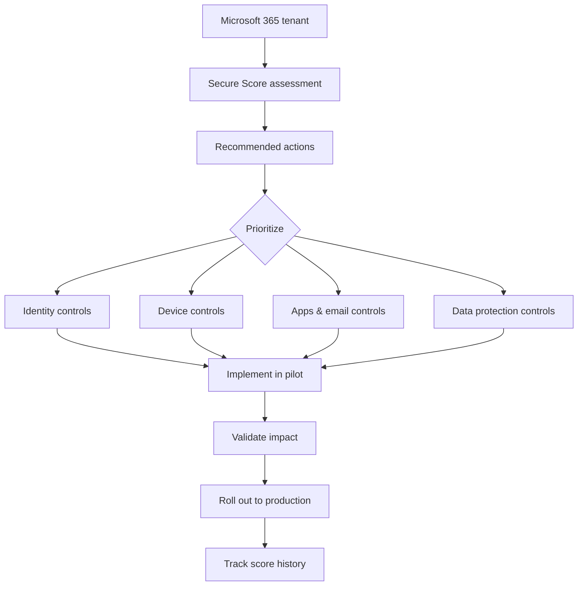
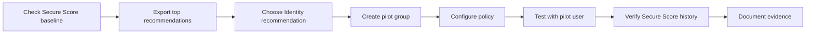

<!--
Visual style suggestion inspired by modern Microsoft Security / training blog layout:
- Hero background: dark navy / deep blue (#071A2F, #0F2B46)
- Primary accent: Microsoft blue / cyan (#0078D4, #00A4EF)
- Secondary accent: purple gradient (#6D28D9, #8B5CF6)
- Highlight accent: amber/orange (#F59E0B)
- Card background: soft blue gray (#F8FAFC, #EEF6FF)
- Use clean enterprise screenshots, dashboard cards, dark-blue gradient banners, and security icons.
-->

import Tabs from '@theme/Tabs';
import TabItem from '@theme/TabItem';

# Microsoft Secure Score: Đo lường và cải thiện tư thế bảo mật Microsoft 365


<p className="image-caption">
Hình đề xuất: banner nền xanh navy, biểu đồ Secure Score, Microsoft Defender portal, biểu tượng Identity – Device – Apps – Data.
</p>

Trong môi trường doanh nghiệp hiện đại, bảo mật không thể chỉ dựa vào cảm tính như “đã bật MFA”, “đã có antivirus” hoặc “đã dùng Microsoft 365 E5”. Điều quan trọng hơn là tổ chức cần một cách đo lường có hệ thống: hiện trạng bảo mật đang ở đâu, điểm yếu nào cần xử lý trước, thay đổi nào giúp giảm rủi ro nhiều nhất, và tiến độ cải thiện có được chứng minh bằng dữ liệu hay không.

**Microsoft Secure Score** là một trong những công cụ quan trọng giúp IT Admin, Security Admin và Modern Workplace Engineer trả lời các câu hỏi đó. Thay vì chỉ liệt kê cấu hình rời rạc, Secure Score cung cấp một bức tranh tổng quan về tư thế bảo mật của tenant Microsoft, kèm các khuyến nghị có thể hành động để cải thiện bảo mật theo từng nhóm như danh tính, thiết bị, ứng dụng và dữ liệu.

:::info Mục tiêu của bài viết
Bài viết này giúp bạn hiểu Microsoft Secure Score ở góc nhìn chuyên gia triển khai: Secure Score là gì, nên đọc điểm số như thế nào, vì sao điểm cao không đồng nghĩa với “an toàn tuyệt đối”, và cách biến Secure Score thành một quy trình cải thiện bảo mật có thể dùng trong doanh nghiệp hoặc portfolio cá nhân.
:::

---

## 1. Microsoft Secure Score là gì?

**Microsoft Secure Score** là một chỉ số đo lường tư thế bảo mật của tổ chức trong hệ sinh thái Microsoft. Điểm số càng cao thường cho thấy tổ chức đã triển khai nhiều hành động bảo mật được Microsoft khuyến nghị hơn. Secure Score được truy cập trong **Microsoft Defender portal** tại đường dẫn:

```text
https://security.microsoft.com/securescore
```

Secure Score không chỉ là một con số. Nó là một hệ thống đánh giá gồm:

- Điểm bảo mật hiện tại của tổ chức.
- Danh sách hành động khuyến nghị.
- Mức điểm có thể đạt được nếu hoàn thành từng hành động.
- Nhóm bảo mật liên quan như Identity, Device, Apps và Data.
- Lịch sử thay đổi điểm theo thời gian.
- Khả năng so sánh, theo dõi xu hướng và xây dựng kế hoạch cải thiện.


<p className="image-caption">
Evidence 01 — Chụp màn hình Microsoft Defender portal &gt; Secure Score overview, che thông tin tenant trước khi public.
</p>

:::warning Không hiểu sai Secure Score
Secure Score **không phải** là xác suất tổ chức sẽ bị tấn công, cũng không phải cam kết rằng tenant sẽ không bị breach. Đây là thước đo mức độ tổ chức đang sử dụng các kiểm soát bảo mật được khuyến nghị trong môi trường Microsoft.
:::

---

## 2. Vì sao doanh nghiệp cần Secure Score?

Trong thực tế, nhiều tổ chức đã mua Microsoft 365 Business Premium, E3 hoặc E5 nhưng chưa khai thác hết các lớp bảo mật đi kèm. Một số chính sách quan trọng như MFA, Conditional Access, audit logging, anti-phishing, endpoint protection, data loss prevention hoặc sensitivity label có thể chưa được bật đầy đủ, bật chưa đúng phạm vi, hoặc chưa được kiểm tra định kỳ.

Secure Score giúp biến vấn đề đó thành một quy trình có thể đo lường.

| Vấn đề trong doanh nghiệp | Secure Score hỗ trợ như thế nào |
|---|---|
| Không biết tenant đang yếu ở đâu | Cung cấp dashboard tổng quan và danh sách khuyến nghị |
| Bảo mật bị triển khai rời rạc | Gom khuyến nghị theo nhóm Identity, Device, Apps, Data |
| Khó ưu tiên việc nào làm trước | Hiển thị điểm tiềm năng và mức tác động của từng action |
| Khó báo cáo với quản lý | Có số liệu, trend và trạng thái cải thiện theo thời gian |
| Dễ cấu hình theo cảm tính | Gắn cải thiện bảo mật với best practice và evidence cụ thể |
| Không có baseline để audit | Dùng điểm hiện tại làm baseline, sau đó đo trước/sau khi triển khai |

:::tip Góc nhìn chuyên gia
Secure Score không nên được xem là “game tăng điểm”. Cách dùng đúng là xem Secure Score như một **security posture improvement backlog**: mỗi recommendation là một work item cần đánh giá rủi ro, tác động người dùng, license, phạm vi triển khai và kế hoạch rollback.
:::

---

## 3. Secure Score đánh giá những nhóm nào?

Trong Microsoft Defender portal, các hành động khuyến nghị của Secure Score thường được tổ chức theo các nhóm lớn sau:

| Nhóm | Trọng tâm đánh giá | Ví dụ kiểm soát bảo mật |
|---|---|---|
| **Identity** | Tài khoản, vai trò, xác thực, rủi ro đăng nhập | MFA, Conditional Access, admin role, legacy authentication |
| **Device** | Bảo mật endpoint và thiết bị người dùng | Microsoft Defender for Endpoint, device configuration, vulnerability exposure |
| **Apps** | Email, cloud apps và ứng dụng cộng tác | Exchange Online, SharePoint, Teams, Defender for Cloud Apps |
| **Data** | Bảo vệ dữ liệu và thông tin nhạy cảm | Microsoft Purview Information Protection, sensitivity label, DLP |


<p className="image-caption">
Hình đề xuất: sơ đồ 4 trụ cột Identity – Device – Apps – Data, ở giữa là Microsoft Secure Score.
</p>

Với góc nhìn Microsoft 365/Security, nhóm **Identity** thường nên được ưu tiên sớm vì danh tính là lớp kiểm soát đầu tiên trong mô hình Zero Trust. Nếu tài khoản quản trị chưa được bảo vệ, các lớp bảo mật phía sau như endpoint, email hoặc data protection sẽ dễ bị vô hiệu hóa hoặc bypass.

---

## 4. Secure Score hoạt động như thế nào?

Secure Score tính điểm dựa trên việc tổ chức đã triển khai các hành động bảo mật được khuyến nghị hay chưa. Khi một recommendation được xử lý, tổ chức có thể nhận thêm điểm tương ứng. Một số action có thể được ghi nhận tự động khi hệ thống phát hiện cấu hình đã thay đổi; một số action cần được đánh giá, ghi chú hoặc xác nhận theo trạng thái phù hợp.

Quy trình tư duy có thể hiểu như sau:



Điểm quan trọng là Secure Score không chỉ ghi nhận trạng thái hiện tại. Nó còn giúp tổ chức theo dõi **lịch sử thay đổi** để biết điểm tăng/giảm do hành động nào, trong khoảng thời gian nào, và thuộc nhóm bảo mật nào.


<p className="image-caption">
Evidence 02 — Chụp tab History để chứng minh điểm Secure Score thay đổi sau khi triển khai policy.
</p>

---

## 5. Secure Score khác gì với việc checklist bảo mật thủ công?

Checklist thủ công vẫn hữu ích, nhưng thường có ba hạn chế: khó cập nhật theo thay đổi sản phẩm, khó chứng minh bằng dữ liệu tenant, và khó theo dõi tiến độ dài hạn. Secure Score giải quyết vấn đề này bằng cách kết nối trực tiếp với môi trường Microsoft và đưa ra khuyến nghị dựa trên trạng thái cấu hình thực tế.

<Tabs>
<TabItem value="manual" label="Checklist thủ công">

- Phụ thuộc vào người tạo checklist.
- Dễ lỗi thời khi Microsoft thay đổi portal hoặc tính năng.
- Cần kiểm tra thủ công từng cấu hình.
- Khó chứng minh mức cải thiện theo thời gian.
- Phù hợp cho SOP nội bộ nhưng không đủ để thay thế dashboard posture.

</TabItem>
<TabItem value="secure-score" label="Secure Score">

- Dựa trên dữ liệu trong Microsoft Defender portal.
- Có recommended actions và điểm tiềm năng.
- Có lịch sử thay đổi và trend.
- Có thể dùng làm baseline cải thiện bảo mật.
- Phù hợp cho báo cáo kỹ thuật, audit nội bộ và portfolio triển khai.

</TabItem>
</Tabs>

---

## 6. Những lợi ích chính của Microsoft Secure Score

### 6.1. Có cái nhìn tổng quan về tư thế bảo mật

Secure Score giúp đội IT và Security nhìn thấy trạng thái bảo mật hiện tại của tenant thay vì chỉ kiểm tra từng portal riêng lẻ. Điều này đặc biệt quan trọng trong môi trường Microsoft 365, nơi cấu hình bảo mật nằm rải rác ở Entra ID, Defender, Exchange, SharePoint, Teams, Intune và Purview.

### 6.2. Ưu tiên hành động theo rủi ro và tác động

Không phải recommendation nào cũng nên triển khai ngay trên toàn bộ tenant. Một số thay đổi có thể ảnh hưởng mạnh đến người dùng, ứng dụng legacy hoặc quy trình vận hành. Secure Score giúp nhóm triển khai biết hành động nào có giá trị cao, nhưng quyết định cuối cùng vẫn cần dựa trên risk assessment, change management và pilot testing.

### 6.3. Biến bảo mật thành roadmap có thể theo dõi

Thay vì nói “cần bảo mật tốt hơn”, Secure Score cho phép đặt mục tiêu rõ ràng hơn, ví dụ:

```text
Current Secure Score: 42%
Target after Phase 1: 55%
Target after Phase 2: 65%
Target after Phase 3: 75%
```

Điều này giúp IT Admin báo cáo tiến độ với quản lý bằng số liệu thay vì cảm tính.

### 6.4. Hỗ trợ tư duy Zero Trust

Secure Score không thay thế Zero Trust, nhưng hỗ trợ triển khai Zero Trust theo cách có cấu trúc. Các khuyến nghị thường liên quan đến những nguyên tắc như xác minh rõ ràng, cấp quyền tối thiểu, giảm bề mặt tấn công và bảo vệ dữ liệu theo ngữ cảnh.

---

## 7. Quy trình triển khai Secure Score theo chuẩn doanh nghiệp

Một lỗi phổ biến là mở Secure Score, thấy recommendation nào điểm cao thì bật ngay. Cách này có thể làm tăng điểm nhanh nhưng dễ gây lỗi vận hành. Trong doanh nghiệp, nên triển khai theo quy trình có kiểm soát.

### Phase 1 — Baseline hiện trạng

Mục tiêu của phase này là ghi nhận trạng thái ban đầu trước khi thay đổi.

Checklist:

- Chụp Secure Score overview.
- Export hoặc ghi lại top recommended actions.
- Phân loại action theo Identity, Device, Apps, Data.
- Ghi nhận license hiện có.
- Xác định user group pilot.
- Xác định tài khoản break-glass.
- Ghi lại rủi ro vận hành nếu bật chính sách mới.


<p className="image-caption">
Evidence 03 — Baseline trước triển khai: điểm hiện tại, nhóm điểm thấp nhất và top actions.
</p>

### Phase 2 — Prioritize theo rủi ro

Không nên triển khai tất cả recommendation cùng lúc. Hãy ưu tiên theo ma trận sau:

| Tiêu chí | Câu hỏi cần trả lời |
|---|---|
| Security impact | Action này giảm rủi ro gì? Identity compromise, phishing, data leakage hay endpoint exposure? |
| User impact | Có ảnh hưởng đăng nhập, email, Teams, mobile hoặc thiết bị cá nhân không? |
| License impact | Tenant có license hỗ trợ tính năng này không? |
| Operational readiness | Helpdesk có biết cách xử lý ticket phát sinh không? |
| Rollback | Nếu người dùng bị ảnh hưởng, có cách rollback hoặc exclude tạm thời không? |
| Evidence | Có thể chụp được bằng chứng trước/sau không? |

### Phase 3 — Pilot trước khi production

Với các thay đổi ảnh hưởng lớn như MFA, Conditional Access, app protection, anti-phishing policy hoặc endpoint security baseline, nên triển khai pilot trước.

Ví dụ pilot group:

```text
SG-M365-SecureScore-Pilot
SG-M365-CA-Pilot
SG-M365-Endpoint-Pilot
SG-M365-Purview-Pilot
```

### Phase 4 — Production rollout

Sau khi pilot ổn định, mới mở rộng ra production theo từng wave:

| Wave | Phạm vi | Mục tiêu |
|---|---|---|
| Wave 1 | IT + Security | Kiểm tra kỹ thuật và hỗ trợ rollback |
| Wave 2 | Department pilot | Kiểm tra tác động theo phòng ban |
| Wave 3 | All standard users | Mở rộng cho người dùng phổ thông |
| Wave 4 | High-risk users | Áp chính sách chặt hơn cho admin, finance, HR, executives |

### Phase 5 — Report và continuous improvement

Secure Score nên được review định kỳ, ví dụ hàng tháng hoặc sau mỗi thay đổi lớn trong tenant. Báo cáo nên tập trung vào:

- Điểm hiện tại.
- Điểm thay đổi so với tháng trước.
- Actions đã hoàn thành.
- Actions chưa triển khai và lý do.
- Rủi ro còn tồn tại.
- Kế hoạch tháng tiếp theo.

---

## 8. Ví dụ roadmap cải thiện Secure Score cho Microsoft 365 tenant

Dưới đây là ví dụ roadmap thực tế cho tenant Microsoft 365 mới bắt đầu chuẩn hóa bảo mật.

| Giai đoạn | Trọng tâm | Ví dụ hành động |
|---|---|---|
| Week 1 | Baseline & visibility | Ghi nhận Secure Score, bật audit, kiểm tra admin roles |
| Week 2 | Identity hardening | MFA, Conditional Access pilot, block legacy authentication |
| Week 3 | Email protection | Defender for Office 365 policy, anti-phishing, safe links/safe attachments |
| Week 4 | Endpoint security | Intune compliance, Defender for Endpoint onboarding, security baseline |
| Week 5 | Data protection | Sensitivity labels, DLP pilot, external sharing review |
| Week 6 | Reporting | Secure Score history, evidence, executive summary |

:::tip Portfolio angle
Nếu bạn đang xây portfolio Microsoft 365 Security, hãy dùng Secure Score để chứng minh năng lực theo format: **Problem → Baseline → Implementation → Verification → Business Impact**. Đây là cách trình bày rất phù hợp cho các vai trò Microsoft 365 Administrator, Endpoint Administrator, Modern Workplace Engineer và Junior Security Administrator.
:::

---

## 9. Các recommendation nên ưu tiên trong môi trường Microsoft 365

Danh sách dưới đây không thay thế khuyến nghị thực tế trong tenant của bạn, nhưng là nhóm kiểm soát thường có giá trị cao trong môi trường Microsoft 365.

### 9.1. Identity & Access

| Kiểm soát | Mục tiêu |
|---|---|
| Bật MFA cho user và admin | Giảm rủi ro credential theft |
| Dùng Conditional Access | Áp kiểm soát theo user, device, location, risk và app |
| Chặn legacy authentication | Giảm nguy cơ bypass MFA qua protocol cũ |
| Kiểm soát privileged roles | Giảm quyền admin thường trực |
| Tạo break-glass accounts | Đảm bảo khả năng truy cập khẩn cấp khi CA/MFA gặp lỗi |

### 9.2. Endpoint & Device

| Kiểm soát | Mục tiêu |
|---|---|
| Enroll thiết bị vào Intune | Quản lý cấu hình và compliance |
| Bật Microsoft Defender for Endpoint | Tăng khả năng phát hiện và phản ứng với threat |
| Áp security baseline | Chuẩn hóa cấu hình Windows 11 |
| Yêu cầu device compliant | Chỉ cho thiết bị đạt chuẩn truy cập tài nguyên |
| Theo dõi vulnerability exposure | Ưu tiên vá lỗi và cấu hình yếu trên endpoint |

### 9.3. Email & Collaboration

| Kiểm soát | Mục tiêu |
|---|---|
| Anti-phishing policy | Giảm nguy cơ giả mạo người dùng và domain |
| Safe Links / Safe Attachments | Kiểm tra liên kết và file độc hại |
| External sharing review | Kiểm soát chia sẻ dữ liệu ra ngoài |
| Teams security review | Kiểm soát guest, external access và app permission |

### 9.4. Data Protection

| Kiểm soát | Mục tiêu |
|---|---|
| Sensitivity labels | Phân loại và bảo vệ dữ liệu |
| DLP policy | Ngăn rò rỉ thông tin nhạy cảm |
| Retention policy | Quản lý vòng đời dữ liệu |
| Audit & eDiscovery readiness | Hỗ trợ điều tra và tuân thủ |

---

## 10. Secure Score và Azure/Cloud Secure Score

Khi nói về “Secure Score”, cần phân biệt hai ngữ cảnh:

| Ngữ cảnh | Portal chính | Phạm vi |
|---|---|---|
| **Microsoft Secure Score** | Microsoft Defender portal | Microsoft 365 identities, apps, devices, data và các workload liên quan |
| **Cloud Secure Score / Defender for Cloud** | Azure portal hoặc Defender portal | Azure, multicloud resources, workload security, misconfigurations, vulnerabilities, exposed secrets |

Nếu tổ chức dùng cả Microsoft 365 và Azure, nên theo dõi cả hai. Microsoft Secure Score giúp đánh giá posture cho Microsoft 365 security, còn Defender for Cloud giúp đánh giá posture cho cloud infrastructure và workload.


<p className="image-caption">
Hình đề xuất: so sánh Microsoft 365 Secure Score và Defender for Cloud Secure Score trên cùng một sơ đồ.
</p>

---

## 11. Sai lầm thường gặp khi sử dụng Secure Score

### Sai lầm 1 — Chạy theo điểm số mà bỏ qua tác động người dùng

Điểm số cao không có nghĩa là chính sách phù hợp với mọi tổ chức. Một số recommendation có thể ảnh hưởng đến ứng dụng cũ, thiết bị không quản lý, user bên ngoài hoặc quy trình kinh doanh đặc thù.

### Sai lầm 2 — Bật chính sách trực tiếp cho toàn bộ tenant

Các thay đổi như Conditional Access, Defender policy hoặc DLP nên được pilot. Luôn kiểm tra nhóm pilot, break-glass account, report-only mode và quy trình rollback trước khi áp dụng rộng.

### Sai lầm 3 — Không ghi lại evidence

Nếu không có ảnh chụp trước/sau, bạn khó chứng minh giá trị triển khai. Với portfolio hoặc audit nội bộ, evidence là phần rất quan trọng.

### Sai lầm 4 — Không review định kỳ

Secure Score có thể thay đổi khi Microsoft cập nhật recommendation, khi tenant thay đổi cấu hình hoặc khi workload mới được bật. Vì vậy, Secure Score nên là quy trình liên tục, không phải bài kiểm tra một lần.

---

## 12. Checklist evidence để đưa vào portfolio

Dưới đây là checklist hình ảnh bạn nên tự chụp và đính kèm vào bài viết/lab:

| Evidence | Ảnh cần chụp | Mục đích |
|---|---|---|
| Evidence 01 | Secure Score overview | Chứng minh baseline |
| Evidence 02 | Recommended actions | Chứng minh các việc cần cải thiện |
| Evidence 03 | Action detail flyout | Chứng minh bạn hiểu từng recommendation |
| Evidence 04 | Policy triển khai | Chứng minh cấu hình thực tế |
| Evidence 05 | Pilot group assignment | Chứng minh triển khai có kiểm soát |
| Evidence 06 | Secure Score history | Chứng minh kết quả sau triển khai |
| Evidence 07 | Before/after summary | Chứng minh business impact |


<p className="image-caption">
Evidence 04 — Recommended actions: lọc theo Identity, Device, Apps hoặc Data.
</p>

---

## 13. Mẫu ghi nhận Secure Score improvement

Bạn có thể dùng bảng dưới đây để tracking khi làm lab hoặc triển khai thật.

| Ngày | Action | Nhóm | Trạng thái | Điểm trước | Điểm sau | Evidence | Ghi chú |
|---|---|---|---|---:|---:|---|---|
| YYYY-MM-DD | Enable MFA for pilot users | Identity | Pilot | 42% | 45% | evidence-01.png | Test với nhóm IT trước |
| YYYY-MM-DD | Block legacy authentication | Identity | Report-only | 45% | 45% | evidence-02.png | Kiểm tra app cũ trước khi enforce |
| YYYY-MM-DD | Enable anti-phishing policy | Apps | Production | 45% | 48% | evidence-03.png | Áp cho Exchange Online |
| YYYY-MM-DD | Enroll Windows devices to Intune | Device | In progress | 48% | 52% | evidence-04.png | Wave 1 cho IT |

---

## 14. Kịch bản lab đề xuất: Secure Score posture improvement

Nếu bạn muốn biến bài viết này thành lab thực hành, có thể triển khai theo kịch bản sau.

### Lab objective

Đánh giá Secure Score hiện tại của tenant Microsoft 365, chọn một nhóm recommendation có rủi ro cao, triển khai pilot, xác minh kết quả và tạo báo cáo trước/sau.

### Lab workflow



### Deliverables

- Secure Score baseline screenshot.
- Recommendation prioritization table.
- Pilot group assignment.
- Policy configuration screenshot.
- Test result screenshot.
- Secure Score history screenshot.
- Executive summary.

:::info Gợi ý viết CV/portfolio
Bạn có thể mô tả project như sau:  
“Performed Microsoft Secure Score assessment for a Microsoft 365 tenant, prioritized identity and endpoint security recommendations, implemented pilot-based remediation using Conditional Access and Intune controls, and documented before/after evidence to demonstrate security posture improvement.”
:::

---

## 15. Kết luận

Microsoft Secure Score là công cụ quan trọng để biến bảo mật Microsoft 365 từ trạng thái “cấu hình rời rạc” thành một quy trình cải thiện có thể đo lường. Khi được sử dụng đúng cách, Secure Score giúp IT và Security team xác định điểm yếu, ưu tiên hành động, triển khai theo pilot, theo dõi tiến độ và báo cáo kết quả bằng dữ liệu rõ ràng.

Điểm số không phải mục tiêu cuối cùng. Mục tiêu thật sự là giảm rủi ro, tăng khả năng kiểm soát, bảo vệ danh tính, thiết bị, ứng dụng và dữ liệu doanh nghiệp theo cách phù hợp với vận hành thực tế.

---

## Tài liệu tham khảo chính thức

- Microsoft Learn — Microsoft Secure Score: https://learn.microsoft.com/en-us/defender-xdr/microsoft-secure-score
- Microsoft Learn — Assess your security posture through Microsoft Secure Score: https://learn.microsoft.com/en-us/defender-xdr/microsoft-secure-score-improvement-actions
- Microsoft Learn — Track your Microsoft Secure Score history and meet goals: https://learn.microsoft.com/en-us/defender-xdr/microsoft-secure-score-history-metrics-trends
- Microsoft Security — Microsoft Secure Score overview: https://www.microsoft.com/en-us/security/business/microsoft-secure-score
- Microsoft Learn — Review security recommendations in Microsoft Defender for Cloud: https://learn.microsoft.com/en-us/azure/defender-for-cloud/review-security-recommendations

---

## Image asset checklist

Tạo thư mục ảnh trong Docusaurus:

```text
static/img/security/secure-score/
```

Đặt tên file đề xuất:

```text
secure-score-hero.png
secure-score-overview-dashboard.png
secure-score-categories.png
secure-score-history.png
secure-score-baseline.png
secure-score-vs-cloud-secure-score.png
secure-score-recommended-actions.png
```

### Prompt gợi ý tạo hero image

```text
Create a professional Microsoft Security style hero image for a technical blog about Microsoft Secure Score.
Use a dark navy and blue gradient background, modern dashboard cards, secure score gauge, identity/device/apps/data icons, subtle Microsoft 365 cloud elements, enterprise cybersecurity theme, clean professional training website style, high contrast, no text.
```

### Prompt gợi ý tạo kiến trúc minh họa

```text
Create a clean enterprise architecture diagram showing Microsoft Secure Score at the center.
Connect four pillars: Identity with Microsoft Entra ID, Device with Microsoft Defender for Endpoint and Intune, Apps with Exchange/SharePoint/Teams/Defender for Cloud Apps, Data with Microsoft Purview.
Use dark blue background, cyan and purple accents, minimal icons, clear arrows, professional Microsoft cloud security style.
```
