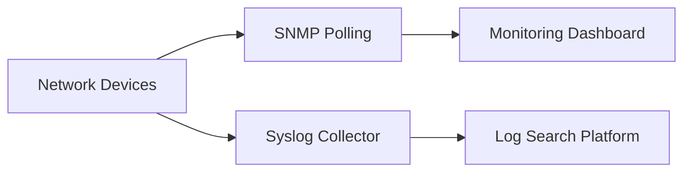

# SNMP, Syslog, and Dashboarding

## Architecture

## Evidence Checklist

- Device inventory and polling method.
- OID mapping or Syslog parsing logic.
- Dashboard screenshot.
- Alerting and escalation notes.
