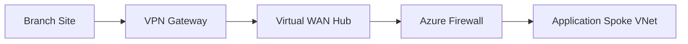

# Virtual WAN, VPN Gateway, and Azure Firewall

## Architecture

```mermaid
flowchart LR
  Branch[Branch Site] --> VPN[VPN Gateway]
  VPN --> VWAN[Virtual WAN Hub]
  VWAN --> Firewall[Azure Firewall]
  Firewall --> Spoke[Application Spoke VNet]
```
