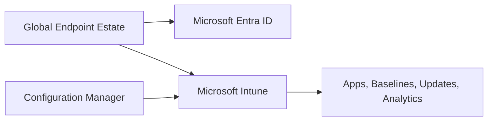

# Global Endpoint Management Case Study

## Context & Challenges

Apex Global operates a 25,000+ endpoint estate across AMER, EMEA, and APAC. The challenge is to standardize management, security, reporting, support, rollout governance, and operational handover.

## Solution Architecture

## Key Implementations

- Co-management and tenant attach architecture.
- Windows Autopilot provisioning.
- Win32 application deployment.
- Windows 11 security baselines.
- Endpoint Analytics and proactive remediation.
- RBAC, SOPs, go-live readiness, and hypercare.

## Results & Impact

The program creates a repeatable endpoint modernization model with clear governance, measurable validation, and production support readiness.
